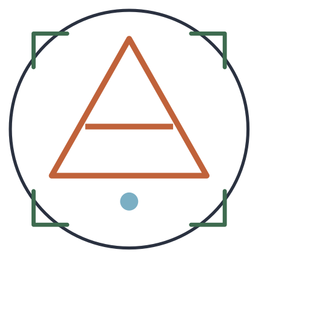

<div align="center">



# aonikenk.dev

Software · Branding · Solutions

🗻 Patagonia, Argentina.

<!-- #### *Crafted at the edge.* -->


[Website](https://aonikenk.dev) · [Contact](mailto:hello@aonikenk.dev)

</div>

---

## About

***aonikenk.dev*** is a digital development studio focused on modern software systems, minimal interfaces and strong visual identity. We craft with character and design digital experiences that convert.

> ***Crafted at the edge.*** Built from Patagonia, Argentina.

We create:

- Full Stack Applications
- Modern Websites
- SaaS Platforms
- APIs & Automation
- UI Systems
- Digital Branding
- AI Integrations
- Networking: wiring components for buildings, commercial networks, rugged housing
- Security: alarm systems, door control

---

## Philosophy

Technology does not need noise.

We believe in:

- clear systems
- minimal interfaces
- strong structure
- thoughtful design
- scalable software

Less noise.
More precision.

---

## Stack

```txt
Backend   → .NET · Node.js · Express.js
Frontend  → React.js · Next.js · Javscript · TypeScript
Database  → PostgreSQL · SQL Server · MongoDB
Cloud     → Azure · Vercel · Cloudflare
AI        → OpenAI · Claude · Agents · Automation
